# Cockpit Plugins

A collection of plugins and extensions for Cockpit server administration.

## Available Plugins

| Plugin | Package Name | Version | Description | Status |
| :--- | :--- | :--- | :--- | :--- |
| [ZFS Storage](#zfs-storage) | `cockpit-zfs-storage` | `0.5.0` | Complete OpenZFS storage manager with pool creation wizards, dataset/zvol trees, snapshots, scrubs, trims, and SMART health monitoring. | Stable |
| [File Sharing](#file-sharing) | `cockpit-file-sharing` | `0.1.0` | Comprehensive SMB (Samba) and NFS file sharing manager with user passdb management, effective permission matrix, and Ansible lock integration. | Stable |

## Installation

### Debian, Ubuntu & Proxmox (APT)

#### One-Line Automated Install (with GPG key):
```shell
curl -fsSL https://mietzen.github.io/cockpit-plugins/install.sh | sudo bash
```

#### Manual Setup (DEB822):
```shell
# 1. Download official GPG signing key
sudo install -m 0755 -d /etc/apt/keyrings
curl -fsSL https://mietzen.github.io/cockpit-plugins/cockpit-plugins.gpg | sudo tee /etc/apt/keyrings/cockpit-plugins.gpg > /dev/null

# 2. Add DEB822 repository source
sudo tee /etc/apt/sources.list.d/cockpit-plugins.sources << 'EOF'
Types: deb
URIs: https://mietzen.github.io/cockpit-plugins/
Suites: stable
Components: main
Signed-By: /etc/apt/keyrings/cockpit-plugins.gpg
EOF

# 3. Update and install
sudo apt update
sudo apt install cockpit-zfs-storage
```

### Rocky Linux, RHEL & Fedora (DNF / YUM)

#### One-Line Automated Install:
```shell
curl -fsSL https://mietzen.github.io/cockpit-plugins/install-rpm.sh | sudo bash
```

#### Manual Setup:
```shell
sudo rpm --import https://mietzen.github.io/cockpit-plugins/key.gpg

sudo tee /etc/yum.repos.d/cockpit-plugins.repo << 'EOF'
[cockpit-plugins]
name=Cockpit Plugins Repository
baseurl=https://mietzen.github.io/cockpit-plugins/rpm/
enabled=1
gpgcheck=1
repo_gpgcheck=1
gpgkey=https://mietzen.github.io/cockpit-plugins/key.gpg
EOF

sudo dnf install -y cockpit-zfs-storage
```

## Plugins

### ZFS Storage

Advanced OpenZFS storage manager for Cockpit built with PatternFly v5.

#### Features

- **Pool Management**:
  - Multi-step Pool Wizard with Stripe, Mirror, RAIDZ1/2/3, and dRAID configurations.
  - Dedicated VDEV roles for Data, Log (SLOG), Cache (L2ARC), and Special (Metadata).
  - Pool import scan with automatic discovery and force import options.
  - Safe pool export and destroy with typed confirmation safeguards.

- **Datasets & Volumes**:
  - Full filesystem and block volume (zvol) creation and management.
  - Hierarchical nested dataset tree.
  - Real-time property editing (Compression `lz4`/`zstd`, Quotas, Deduplication, Record sizes, Mountpoints).
  - Mount, unmount, rename, and delete actions.

- **Snapshots & Clones**:
  - Dataset-specific snapshot creation with target selectors.
  - Clickable snapshot badges in Datasets tab that uncollapse and focus target snapshots.
  - Rollback, clone, rename, and bulk snapshot destruction.

- **Maintenance**:
  - Real-time progress monitoring for scrubs and trims.
  - Start, pause, resume, and cancel verification operations.

- **Disks & SMART**:
  - Comprehensive drive enumeration with model, serial, temperature, and SMART health.
  - Disk offline, online, replace, and attach actions.

- **Performance & Theming**:
  - Built with PatternFly v5 and synchronized with Cockpit Dark / Light shell theme.
  - Pure in-memory view routing for true 0ms redraw and zero iframe flicker.

#### Screenshots

##### Overview & Dashboard
| Light Theme | Dark Theme |
| :---: | :---: |
| 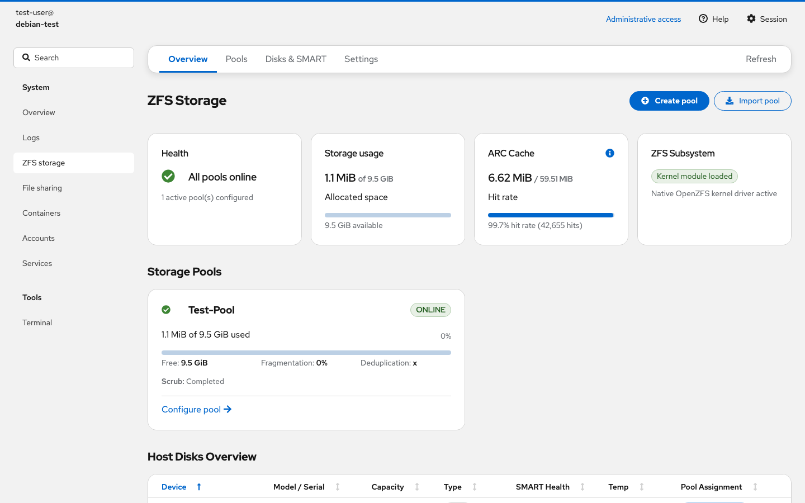 | 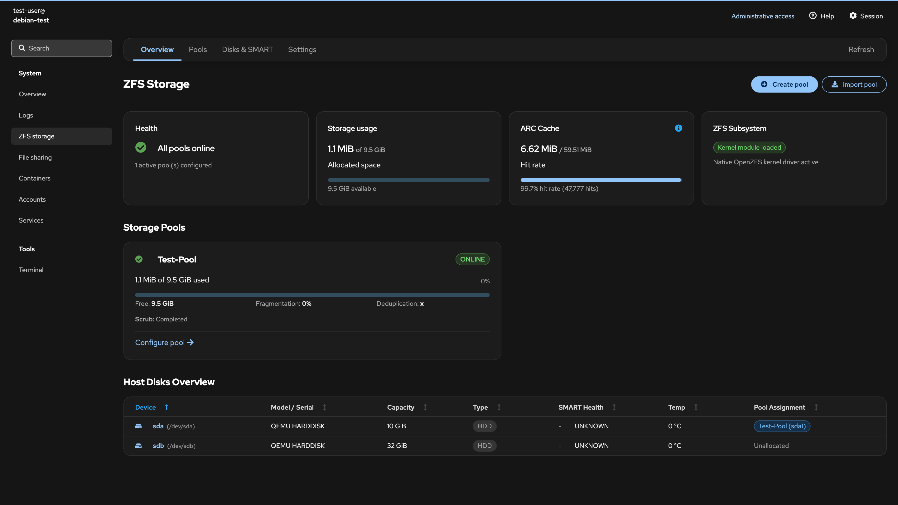 |

##### Storage Pools
| Light Theme | Dark Theme |
| :---: | :---: |
| 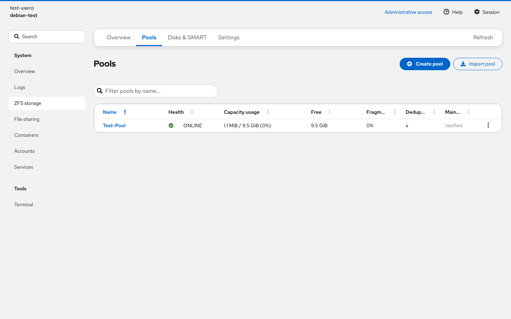 | 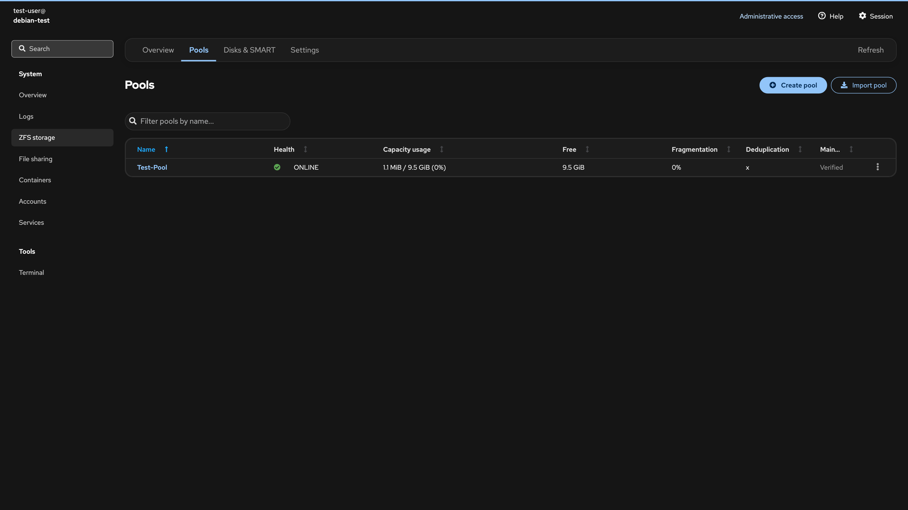 |

##### Pool Topology & Physical Devices
| Light Theme | Dark Theme |
| :---: | :---: |
|  |  |

##### Datasets & Volumes (ZFS zvols)
| Light Theme | Dark Theme |
| :---: | :---: |
| 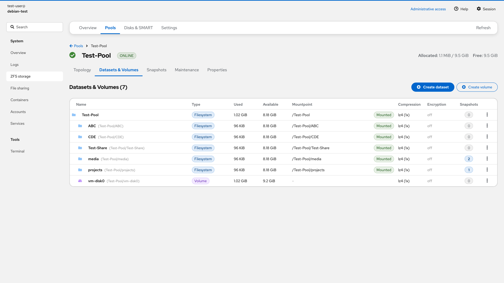 | 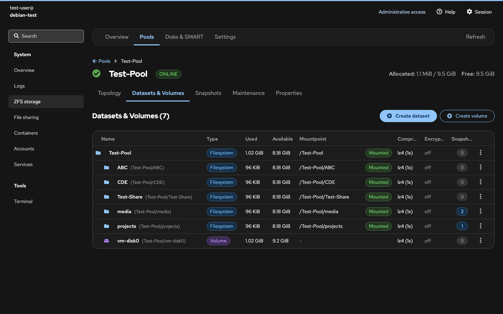 |

##### Snapshots Tree & Target Focus
| Light Theme | Dark Theme |
| :---: | :---: |
| 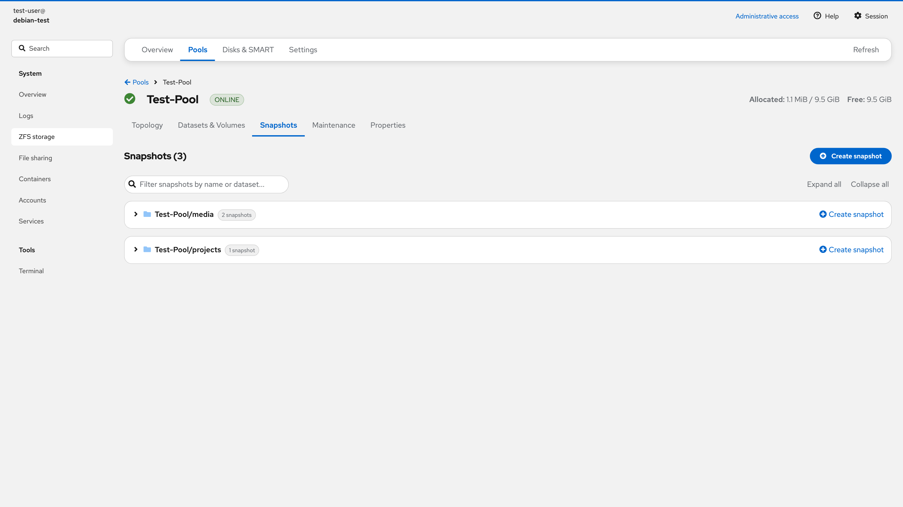 | 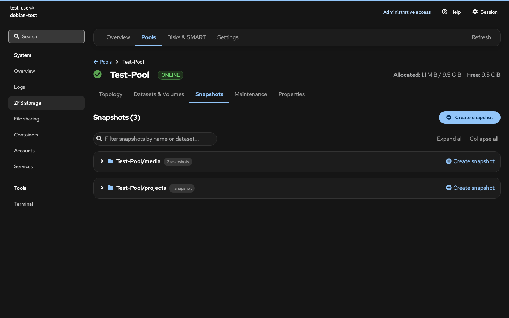 |

##### Pool Maintenance (Scrub & Trim)
| Light Theme | Dark Theme |
| :---: | :---: |
| 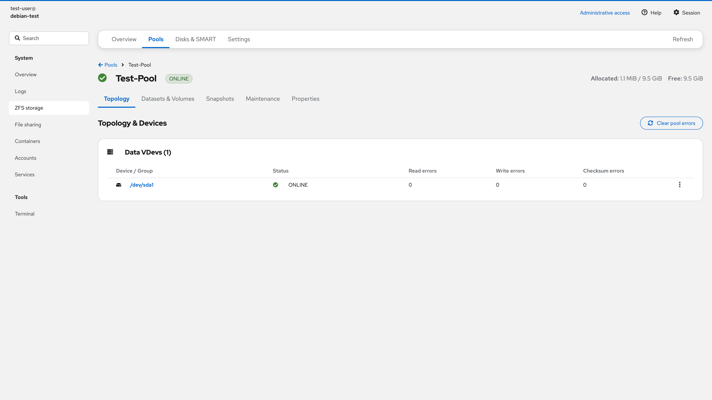 | 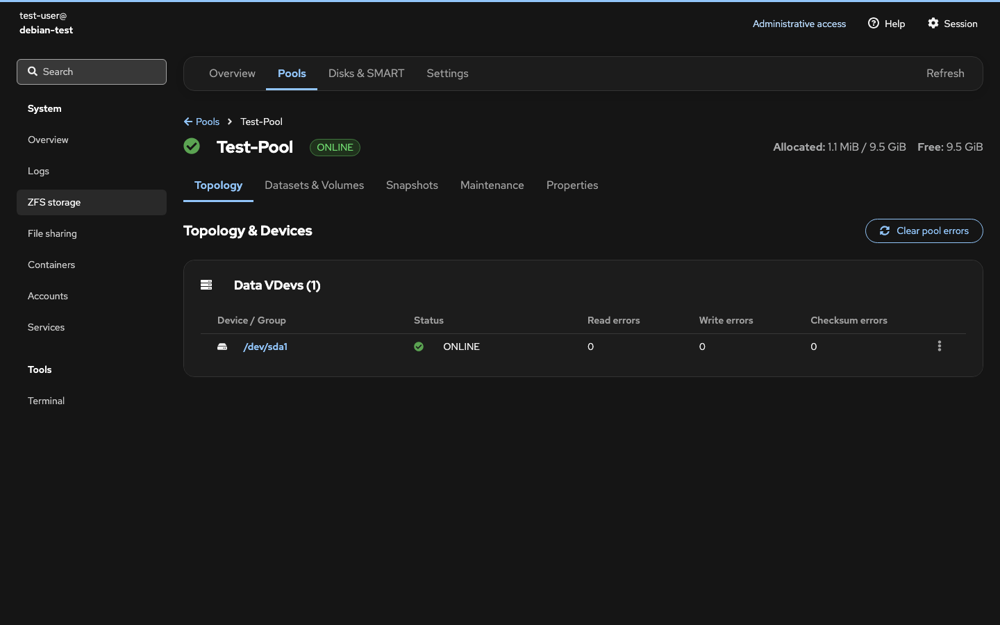 |

##### Disks & SMART Health
| Light Theme | Dark Theme |
| :---: | :---: |
| 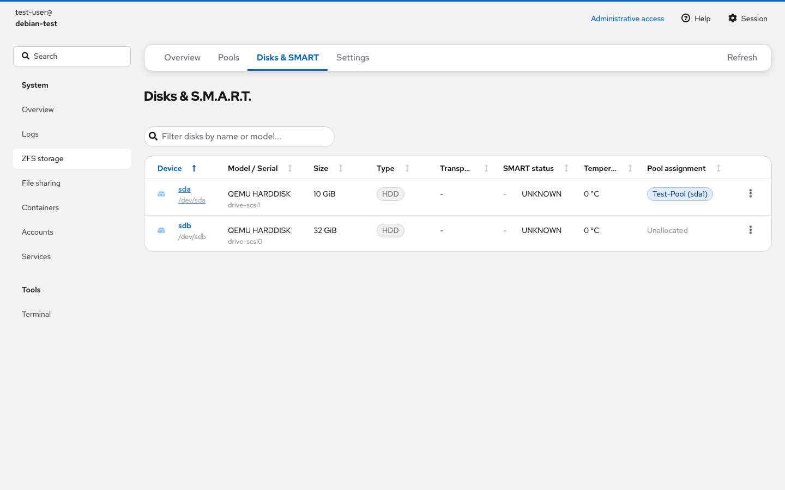 | 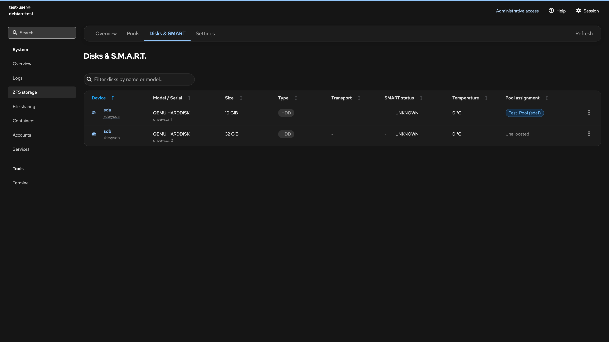 |

##### Create Pool Wizard
| Light Theme | Dark Theme |
| :---: | :---: |
|  | 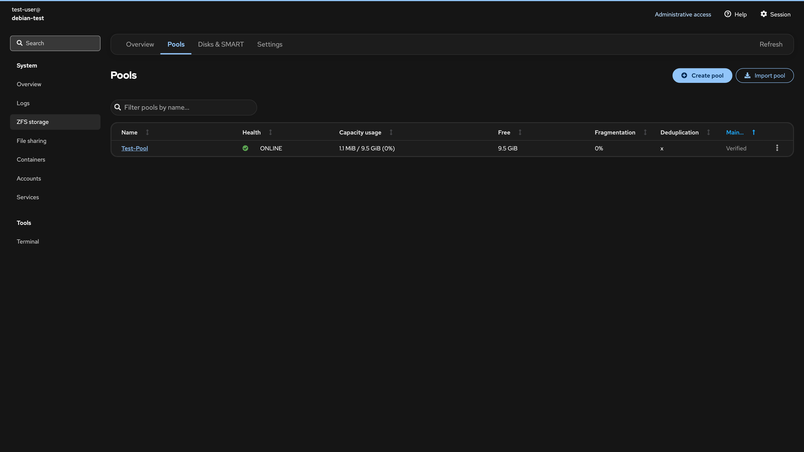 |

## Building From Source

```shell
# Clone repository
git clone https://github.com/mietzen/cockpit-plugins.git
cd cockpit-plugins

# Build all plugins
make build

# Build Debian packages (.deb)
make deb

# Build RPM packages (.rpm)
make rpm

# Install locally
sudo make install
```

### Remote Deployment

Deploy directly to a remote test machine over SSH:

```shell
make deploy TARGET=user@192.168.1.100
```

## End-to-End Testing

The repository includes a Playwright test suite that tests live Cockpit and OpenZFS on Linux runners:

```shell
# Setup virtual test disks and user
sudo bash plugins/zfs-storage/e2e/setup_test_env.sh

# Run Playwright test suite
make e2e
```

## DevContainer Development

Open this monorepo in VS Code or GitHub Codespaces with DevContainers:
- Base image: `ghcr.io/mietzen/docker-mise-devcontainer:latest` (Debian Trixie)
- Pre-installed: Cockpit, OpenZFS utilities, Node.js 24, Python 3.12, and Playwright dependencies
- Command: Run `Dev Containers: Reopen in Container` in VS Code.
